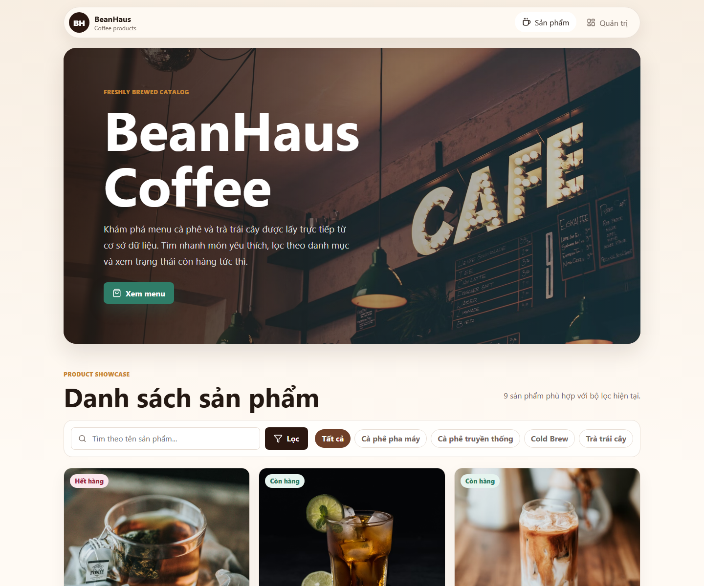
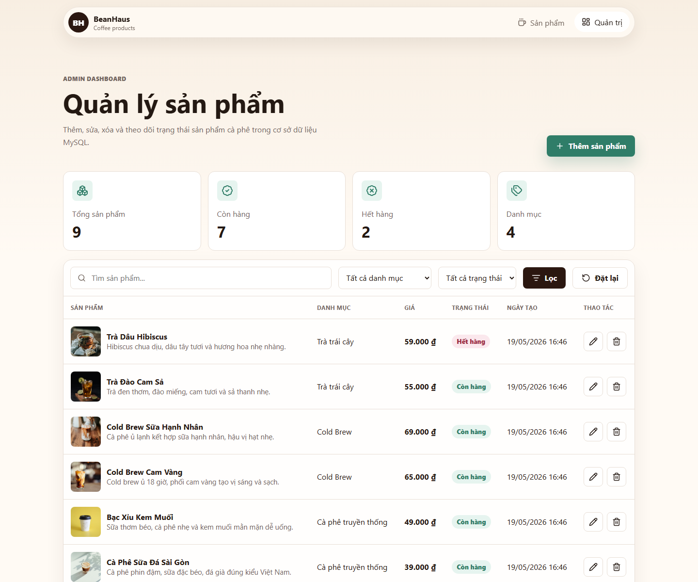
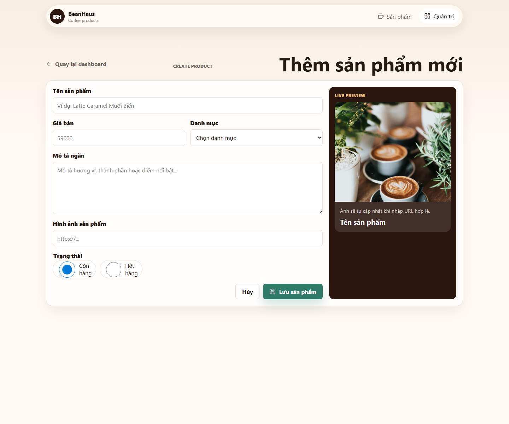

# Coffee Product System

Website quản lý và hiển thị sản phẩm cà phê cho môn Công nghệ Phần mềm. Dự án dùng Express, EJS, MySQL 8.0 và giao diện responsive hiện đại.

## Ảnh minh họa







## Chức năng

- Trang khách hàng hiển thị sản phẩm từ MySQL: hình ảnh, tên, giá, mô tả, danh mục, trạng thái còn hàng/hết hàng.
- Tìm kiếm theo tên và lọc theo danh mục.
- Modal xem nhanh sản phẩm, hiệu ứng reveal, hover, toast thông báo và fallback ảnh.
- Admin dashboard có thống kê, bảng sản phẩm, lọc theo tên/danh mục/trạng thái.
- CRUD đầy đủ: thêm, sửa, xóa sản phẩm.
- Validation form: tên/mô tả không rỗng, giá lớn hơn 0, URL ảnh hợp lệ, danh mục và trạng thái hợp lệ.
- Xóa có hộp thoại xác nhận để tránh thao tác nhầm.
- Tự tạo bảng `Categories`, `Products` và seed dữ liệu mẫu khi chạy server lần đầu.
- Cấu hình UTF-8/utf8mb4 để hiển thị tiếng Việt đúng dấu.

## Cấu trúc CSDL

File thiết kế bảng nằm ở `sql/schema.sql`.

- `Categories`: `Id`, `Name`, `Description`, `Created_At`.
- `Products`: `Id`, `Name`, `Price`, `Description`, `Image_URL`, `Category_Id`, `Status`, `Created_At`.
- `Products.Category_Id` liên kết khóa ngoại tới `Categories.Id`.

## Cấu hình database

Tạo file `.env` từ `.env.example` và điền thông tin database của môi trường chạy:

```env
DB_HOST=
DB_PORT=
DB_USER=
DB_PASS=
DB_NAME=
PORT=
```

## Chạy dự án

```bash
npm install
npm run db:init
npm run dev
```

Sau đó mở:

- Trang khách hàng: `http://localhost:3000`
- Trang quản trị: `http://localhost:3000/admin`

## Lưu ý UTF-8

Các file `.js`, `.ejs`, `.css`, `.sql` nên được lưu bằng UTF-8. Nếu PowerShell hiển thị tiếng Việt bị sai dấu, đó thường là do encoding của terminal; nội dung HTML vẫn có `<meta charset="utf-8">`, response server đặt `charset=utf-8`, MySQL dùng `utf8mb4`.
